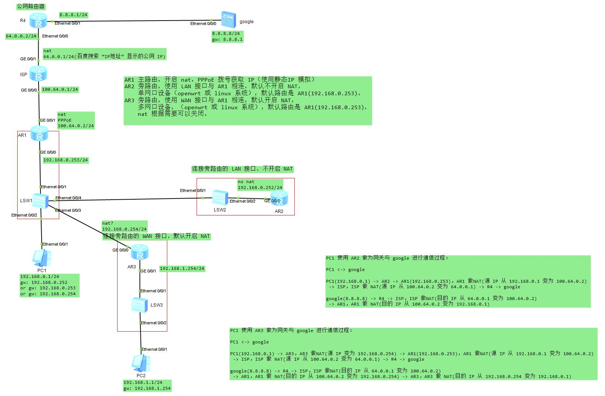

# 03c.bypass_mode

旁路由原理，拓扑实验。

## 网络拓扑

AR1，AR2，AR3 在同一个广播域中。

PC1 的网关可以是 AR2，AR3，AR1。

1. AR1 主路由，开启 nat，PPPoE 拨号获取 IP（使用静态IP 模拟）
2. AR2 旁路由，使用 LAN 接口与 AR1 相连，默认不开启 NAT，单网口设备（openwrt 或 linux 系统），默认路由是 R1(192.168.0.253)。
3. AR3 旁路由，使用 WAN 接口与 AR1 相连，默认开启 NAT，多网口设备，（openwrt 或 linux 系统），默认路由是 R1(192.168.0.253)，nat 根据需要可以关闭。因为是多网口设备，PC2 模拟连接到 AR3 的一个 LAN 接口。

## 双重 nat

使用旁路由 AR3 做为网关时，AR3 的 WAN 接口有配置 NAT，而且 AR1 的 WAN 接口也有 NAT，这就是两次 NAT。

PC1 使用 AR3 做为网关与 google 进行通信过程：

PC1 <-> google

PC1(192.168.0.1) -> AR3，AR3 做NAT(源 IP 变为 192.168.0.254) -> AR1(192.168.0.253)，AR1 做NAT(源 IP 从 192.168.0.1 变为 100.64.0.2)
 -> ISP，ISP 做 NAT(源 IP 从 100.64.0.2 变为 64.0.0.1) -> R4 -> google

google(8.8.8.8) -> R4 -> ISP，ISP 做NAT(目的 IP 从 64.0.0.1 变为 100.64.0.2)
 -> AR1，AR1 做 NAT(目的 IP 从 100.64.0.2 变为 192.168.0.254) -> AR3，AR3 做 NAT(目的 IP 从 192.168.0.254 变为 192.168.0.1)

使用旁路由 AR2 做为网关时，AR3 的 LAN 接口没有配置 NAT，但是 AR1 的 WAN 接口也有 NAT，这就是一次 NAT。

PC1 使用 AR2 做为网关与 google 进行通信过程：

PC1 <-> google

PC1(192.168.0.1) -> AR2 -> AR1(192.168.0.253)，AR1 做NAT(源 IP 从 192.168.0.1 变为 100.64.0.2)
 -> ISP，ISP 做 NAT(源 IP 从 100.64.0.2 变为 64.0.0.1) -> R4 -> google

google(8.8.8.8) -> R4 -> ISP，ISP 做NAT(目的 IP 从 64.0.0.1 变为 100.64.0.2)
 -> AR1，AR1 做 NAT(目的 IP 从 100.64.0.2 变为 192.168.0.1)

PC1 使用 AR2 做为网关与 google 进行通信过程：

openwrt 通过添加防火墙规则来开启 NAT 的理由：
>
>当终端设备可以手动设定网关和 DNS 指向旁路网关，访问某些网站服务器时：
上行数据包路径：终端设备 -> 旁路网关 -> 主路由 -> Internet -> 某网站服务器
>
>如果不添加防火墙规则，由于主路由和终端设备在同一网段，数据包会直接返给终端设备：
下行数据包路径：某网站服务器 -> Internet -> 主路由 -> 终端设备
>
>此时，由于路由不能闭合，可能导致旁路网关一直收不到下行数据包，造成大量 TCP 连接不能关闭，
最终形成网络拥塞或卡顿，所以才会建议在旁路网关上添加防火墙规则：
iptables -t nat -I POSTROUTING -o eth0 -j MASQUERADE
>
>这条命令的目的，是把从终端设备发送的上行数据包源地址伪装成旁路网关自身地址，
于是，主路由返回的下行数据包才会先发送到旁路网关，再由旁路网关发送到终端设备，
最终形成一个闭合的 TCP 连接，即：
下行数据包路径：某网站服务器 -> Internet -> 主路由 -> 旁路网关 -> 终端设备
>
>
>https://www.right.com.cn/forum/forum.php?mod=redirect&goto=findpost&ptid=5512947&pid=16261115

`iptables -t nat -I POSTROUTING -o eth0 -j MASQUERADE`  这条命令的作用简单来说就是使能旁路由 LAN 接口的 NAT。WAN 接口默认开启 NAT。

> 如果不开启 LAN 接口的 NAT，回来的包都不经过旁路由，怎么去广告呢？科学留学也成了问题了，回来的包不经过旁路由，谁去给你解密呢？？？所以需要加一句：iptables -t nat -I POSTROUTING -o eth0 -j MASQUERADE，开启 NAT 后，去程包的源IP会改为旁路由的IP，这样回程包先发给旁路由，旁路由完成了一系列不可描述的功能后，旁路由再根据NAT表，发送给相应设备。
>
> 【终极指南】关于N1做旁路由添加 iptables 自定义防火墙规则的见解
https://www.right.com.cn/forum/thread-2983767-1-1.html
(出处: 恩山无线论坛)
